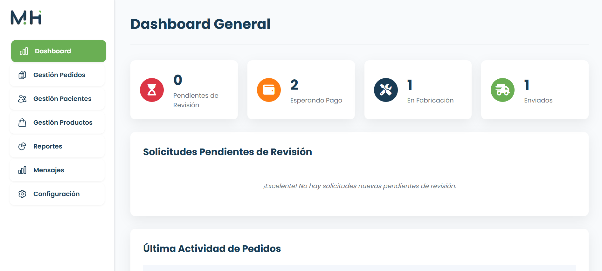
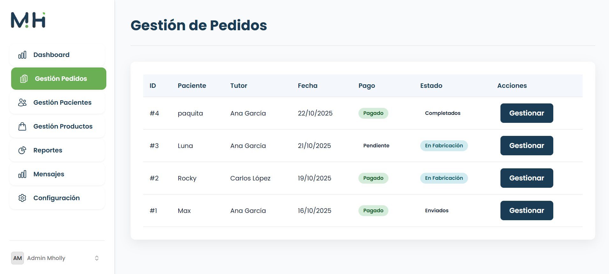
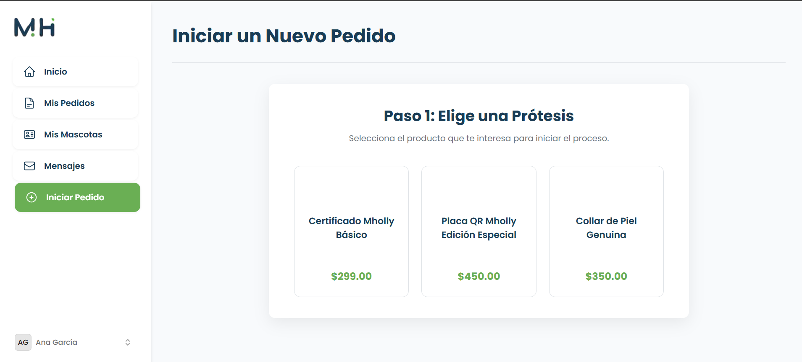
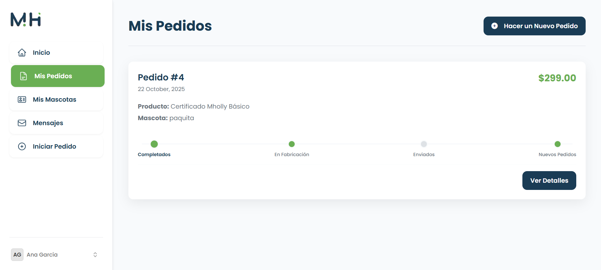
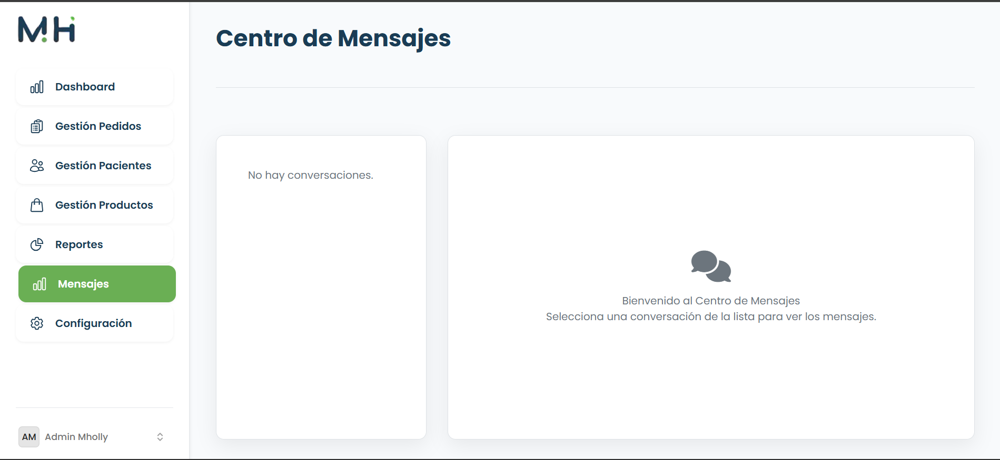
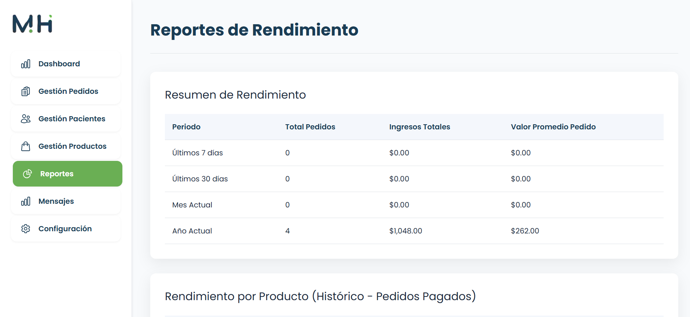

# Mholly - Plataforma Integral de Prótesis Veterinarias 🐾

> **Proyecto:** Sistema B2C y ERP ligero para la manufactura y venta de prótesis animales.
> **Rol:** Desarrollador Full Stack (Arquitectura, Frontend Reactivo y Lógica de Negocio).

## 📖 Visión del Proyecto
**Mholly** no es solo una tienda en línea; es una plataforma de gestión para productos personalizados.

El desafío principal era conectar a los dueños de mascotas (que necesitan guía y seguimiento) con el taller de manufactura. Desarrollé una solución que permite no solo la venta, sino el **seguimiento en tiempo real del proceso de fabricación** (Impresión 3D, Ensamblaje, Envío) y la comunicación directa entre las partes.

---

## 👥 Roles y Ecosistema

El sistema implementa una arquitectura de **múltiples inquilinos (Multi-tenancy logic)** separando completamente la experiencia del administrador de la del cliente.

### 1. Panel de Administración (Back-Office)
Un centro de comando para gestionar el negocio. Permite visualizar métricas financieras, cambiar el estado de los pedidos (que notifica al cliente) y gestionar el catálogo.

| Dashboard General (KPIs) | Gestión de Pedidos y Estados |
|:---:|:---:|
|  |  |

### 2. Experiencia del Cliente (Frontend)
Diseñé un flujo de usuario intuitivo para iniciar pedidos personalizados y, lo más importante, una **Línea de Tiempo de Fabricación** para reducir la ansiedad del cliente sobre su pedido.

| Inicio de Pedido Personalizado | Tracking en Tiempo Real |
|:---:|:---:|
|  |  |

---

## 💬 Módulos de Valor Agregado

### Sistema de Soporte Interno
En lugar de depender de correos externos, implementé un **Chat en la App**. Los clientes pueden resolver dudas sobre las medidas de la prótesis directamente con el taller.

### Inteligencia de Negocios (BI)
Módulo de reportes que calcula automáticamente los ingresos totales, el valor promedio del pedido (AOV) y el rendimiento por producto.

---

## ⚡ Stack Tecnológico & Arquitectura

* **Frontend Reactivo (Laravel Volt + Alpine.js):** Utilicé *Functional API* de Volt para crear componentes dinámicos (como el chat y el tracking) sin la sobrecarga de instalar React/Vue por separado. Esto asegura una carga ultra-rápida.
* **Base de Datos Relacional:** Diseño normalizado para manejar `Users`, `Pets`, `Orders`, `Order_Status_History` y `Messages`.
* **Seguridad:** Implementación de Policies y Gates en Laravel para asegurar que un cliente solo pueda ver *sus* propios pedidos y mascotas.

---

### 🚀 Desafío Técnico: La Línea de Tiempo
Programar la lógica detrás de la barra de progreso del pedido (`client_tracking.png`) fue un reto interesante. Requiere consultar el historial de estados de la base de datos y mapearlos dinámicamente en el frontend para mostrar visualmente en qué etapa exacta se encuentra la manufactura (Pendiente -> En Fabricación -> Enviado).

---

### 📬 Contacto
